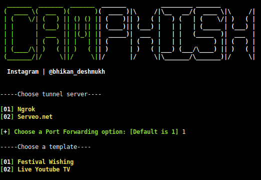

<p align="center"><a> </a>

<p align="center">
	
</p>

# <p align="center">Multi-Mail-Sender

<p align="center">
<a href="https://github.com/bhikandeshmukh"></a>
 <a href="https://github.com/bhikandeshmukh/Termux-Keys"></a>
 <a href="https://github.com/bhikandeshmukh"></a>
</p>

# CamPhish
Grab cam shots from target's phone front camera or PC webcam just sending a link.

# What is CamPhish?
<p>CamPhish is techniques to take cam shots of target's phone fornt camera or PC webcam. CamPhish Hosts a fake website on in built PHP server and uses ngrok & serveo to generate a link which we will forward to the target, which can be used on over internet. website asks for camera permission and if the target allows it, this tool grab camshots of target's device</p>

## Features
<p>In this tool I added two automatic webpage templates for engaged target on webpage to get more picture of cam</p>
<ul>
  <li>Festival Wishing</li>
  <li>Live YouTube TV</li>
</ul>
<p>simply enter festival name or youtube's video ID</p>

## This Tool Tested On :
<ul>
  <li>Kali Linux</li>
  <li>Termux</li>
  <li>MacOS</li>
  <li>Ubuntu</li>
  <li>Perrot Sec OS</li>
</ul>

# Installing and requirements
<p>This tool require PHP for webserver, SSH or serveo link. First run following command on your terminal</p>

```
apt-get -y install php openssh git wget
```

## Installing (Kali Linux/Termux):

```
git clone https://github.com/bhikandeshmukh/CamPhish
cd CamPhish
bash camphish.sh
```

## Legal Disclaimer:

Usage of the tool for attacking targets without prior mutual consent is illegal. It's the end user's responsibility to obey all applicable local, state and federal laws. Developers assume no liability and are not responsible for any misuse or damage caused by this program

<p>CamPhish is created to help in penetration testing and it's not responsible for any misuse or illegal purposes.</p>
<p>CamPhish is inspired by https://github.com/thelinuxchoice/ Big thanks to @thelinuxchoice</p>

<p align="center">
<h4 align="center">♨️ FOLLOW ♨️<h4 align="center">
<a href="https://www.instagram.com/bhikan_deshmukh/"></a>
<a href="https://wa.me/918600525401"></a>
<a href="https://www.facebook.com/thebhikandeshmukh"></a>
<a href="https://www.twitter.com/bhikan_deshmukh/"></a>
<a href="https://t.me/dev_aladdin"></a>
<a href="https://rzp.io/l/mrbee"></a>
<a href="https://blockchain.com/btc/payment_request?address=3FH8UiVVKE5RkCaoaJ9Drr33Dg9L9FtsAq&amount=0.00008703&message=DONATE"></a>
</p>  

